<!-- Drop dark.svg and light.svg in the repo root of <your-username>/<your-username>,
     then paste this at the very top of README.md -->

<picture>
  <source media="(prefers-color-scheme: dark)" srcset="./dark.svg">
  <source media="(prefers-color-scheme: light)" srcset="./light.svg">
  
</picture>

<!--
Notes
-----
* GitHub renders SVG through , so SMIL animations (the reveal wipe,
  scanline, blinking LIVE dot and cursor) all play. CSS and JS would not.
* Edit INFO / STACK in the PROFILE block at the top of banner_generator.py
  and re-run to regenerate both themes:

      pip install opencv-python-headless numpy
      python banner_generator.py headshot.png

* Tuning knobs in banner_generator.py:
      COLS, ROWS   -> halftone resolution (higher = finer dots, bigger file)
      1.32 / 1.06  -> contrast / gamma in portrait_runs()
      0.86         -> dot size as a fraction of the cell in portrait_svg()
      THEMES       -> colour palettes for dark and light
-->
